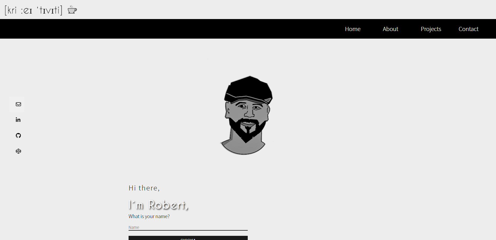
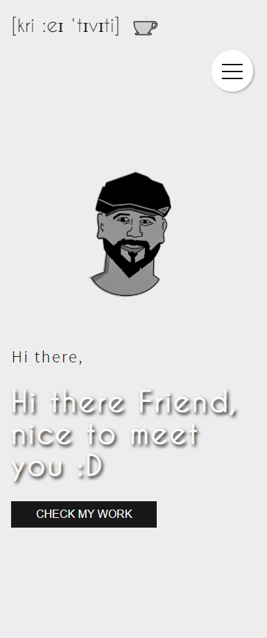

# PORTFOLIO
## Assignment - 5

So our 5th assignment is to create a portfolio
so i've gathered everything i learned and 
tried out so far

I choose to do the project in "vanilla" js, html , css, anime.js (as my "plugin")

## For CME

This github pages version is the most updated, the hosted on my domain is not updated with all new features. 

## __Preview__

 &nbsp; &nbsp;

 &nbsp; &nbsp;

 

# __Languages and Tools:__
[][vscode]
[][html]
[][css]
[][javascript]

[ANIMEJS][animejs]
 

### Issues, thoughts, fixes

- contact page not 100% done with design, click on envelope to see animation and see the form

- Dynamic nav on index page not 100% bug free (only using it now on this project, will change it)

- a and button errors due to not setting title, using icons
(will fix)

- I'm mixing sizes between px, rems and ems and this is not recommended, I wanted to try to learn the differences and also try out, hope this is ok. 

- css is fun, can get messy at times ;)

- I understand why people use bootstrap and tailwind, to work faster and have pre set styling. 

- Text effect using javascript was a challendge its not perfect but its working

- Animations, keyframes and transitions is too much fun
could spend our on this, love it. 
Anime.js is a awesome library, should definitly check it out. 
Animations makes the pages come alive. 
Definitly need to get better and deep dive at one point

- i work in separate project testing before adding, i like this, i could just do  more branches, but I kind of like having it locally for now. Probably will add branches so i can keep some ideas and test online

- Iphone and safari has been a bit of a problem when setting viewport height and width. 

- Project tested on laptop 14 inch and desktop 27 inch screen, Samsung 22, Samsung 10, Iphone 13, Huawei 10, Iphone se and Ipad pro 2018 edition and an LG 55 oled TV. (lol) 

## navigations dropdown

I've took a try to make it dynamic (got a challenge from Alexis), I also host one on codepen and you can find this in my navigations repo. 
It is not 100% dynamic, but on its way. 
Only using this on index page, other pages has set nav in html and css

## Project tech
Using only html, css and js and anime.js
Icons, images and design using figma and photopea

## __My Socials__

- Github - [robonexx](https://github.com/xxrobone)
- Linkedin - [Robert Wägar](https://www.linkedin.com/in/robert-w%C3%A4gar-1b4661139/)
- Portfolio - [Robert Wägar](https://www.robertwagar.se/)

 

[vscode]: https://code.visualstudio.com/
[javascript]: https://developer.mozilla.org/en-US/docs/Web/JavaScript
[html]: https://www.w3schools.com/html/
[css]: https://www.w3.org/Style/CSS/Overview.en.html

[animejs]: https://animejs.com/